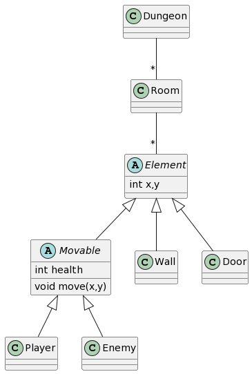
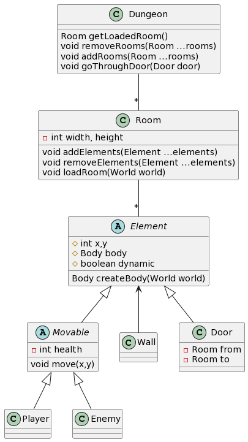

## Sprint0

Backlogs, diagramme sprint0 début, diagramme sprint0 fin, sprint rétrospective et sprint review

### Backlog

- [X] Création du projet avec compilation libgdx
- [X] Map par défaut - Matthieu
- [X] Placement personnage - Paul
- [X] Mouvement personnage - Arthur
- [X] Passage à travers les portes personnage - Zinedine
- [X] Collision avec les murs personnage - Paul, Zinedine

- [X] Test de chaque fonctionnalité - Arthur, Paul, Matthieu, Zinedine

### Diagramme de classes Sprint0 début

### Diagramme de classes Sprint0 fin

### Rétrospective

Tout a bien été implémenté
Des changements dans l'implémentation finale mais pas de gros changements de conception
Petite incompréhension/embrouille des consignes finales sur la rétrospective et des diagrammes de classe (c'est pour ça qu'ils arrivent que maintenant)
Manque de communication comblé par la mise en place d'un Trello (qui redit les choses dites dans le readme)