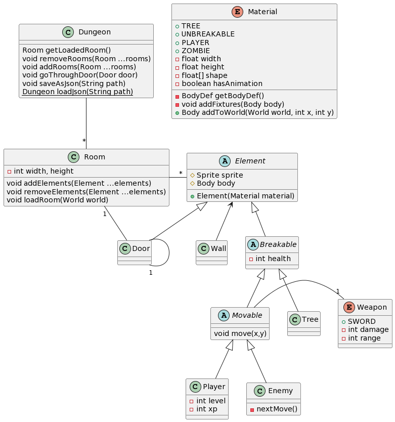
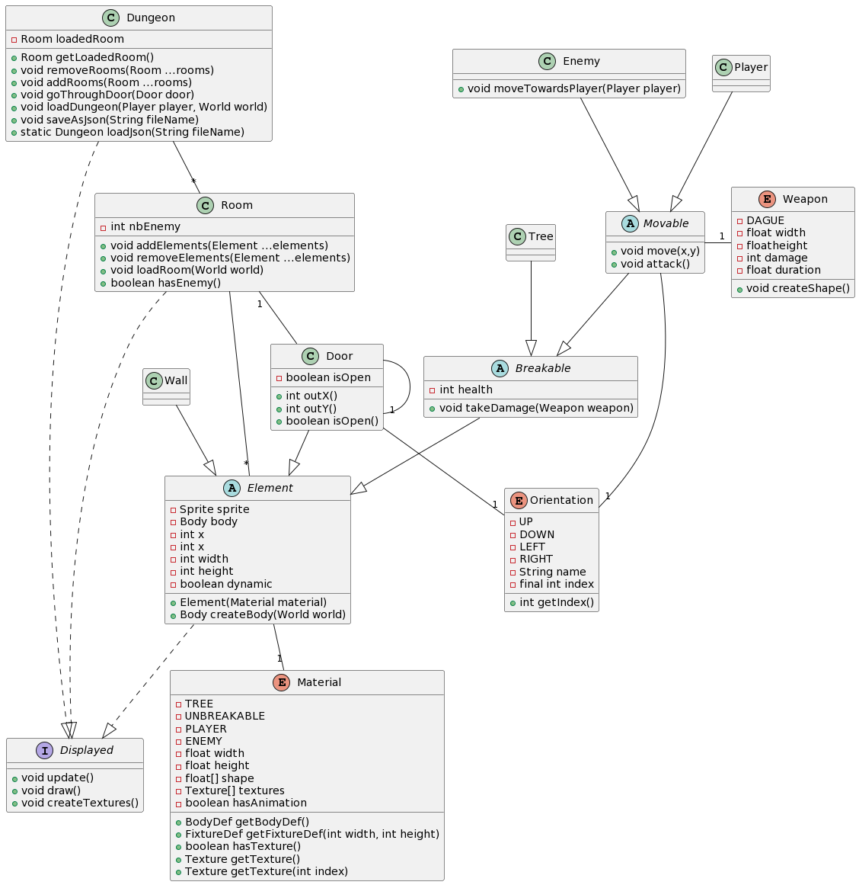

## Sprint1

Backlogs, diagramme sprint1 début, diagramme sprint1 fin, sprint rétrospective et sprint review

### Backlog

- [X] Création d'une factory (changer taille des différents éléments, porte qui contient la currentRoom et une porte) - Matthieu
- [X] Map sous format json - Matthieu
- [X] Modification du mouvement des joueurs (plus fonctionnel) - Arthur
- [X] Ennemis avec IA (rudimentaire ou pas) - Arthur
- [X] Objets cassables qui sont effectivement cassables - Zinedine
- [X] Joueur qui peut attaquer - Paul
- [X] Pas de changement de salle tant qu'il reste des ennemis dans celle-ci - Zinedine
- [X] Caméra fixée sur le joueur (et non plus sur la salle entière) - Zinedine
- [X] Salle Neutre - Zinedine (oubli de tâche)

(Optionnel)
- [X] Graphismes du joueurs - Paul

(Au long du sprint)
- [~] Tests - Arthur, Paul, Matthieu, Zinedine
- [X] Javadoc - Arthur, Paul, Matthieu, Zinedine

(Ajouts pendant le sprint)

- [X] Graphismes murs - Matthieu
- [X] Graphismes arbres - Zinedine
- [X] Graphismes portes - Matthieu
- [ ] Fond pour la map

### Diagramme de classes Sprint1 début

### Diagramme de classes Sprint1 fin

### Rétrospective

Tout a bien été implémenté, voire même plus (nous n'avions pas vu qu'il y avait 3-4 semaines et non pas deux).
Encore des changements dans l'implémentation finale mais pas de gros changements.
Meilleure communication.
Tests vraiment utiles quand LibGDX les fait ? (Le projet dépend de celui-ci donc il est compliqué de tester le back sans celui-ci).
Deux-trois bugs peuvent quand même être observés, à corriger dans les prochaines versions (principalement sur le placement des graphismes et des hitboxs et sur la forme de ceux-ci)