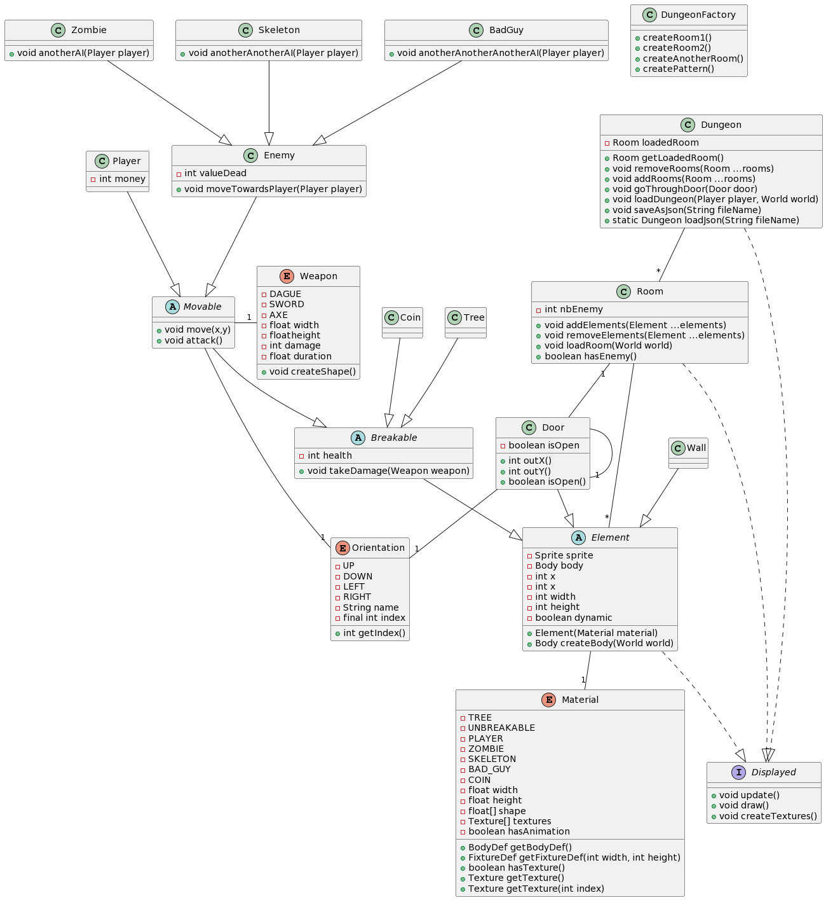
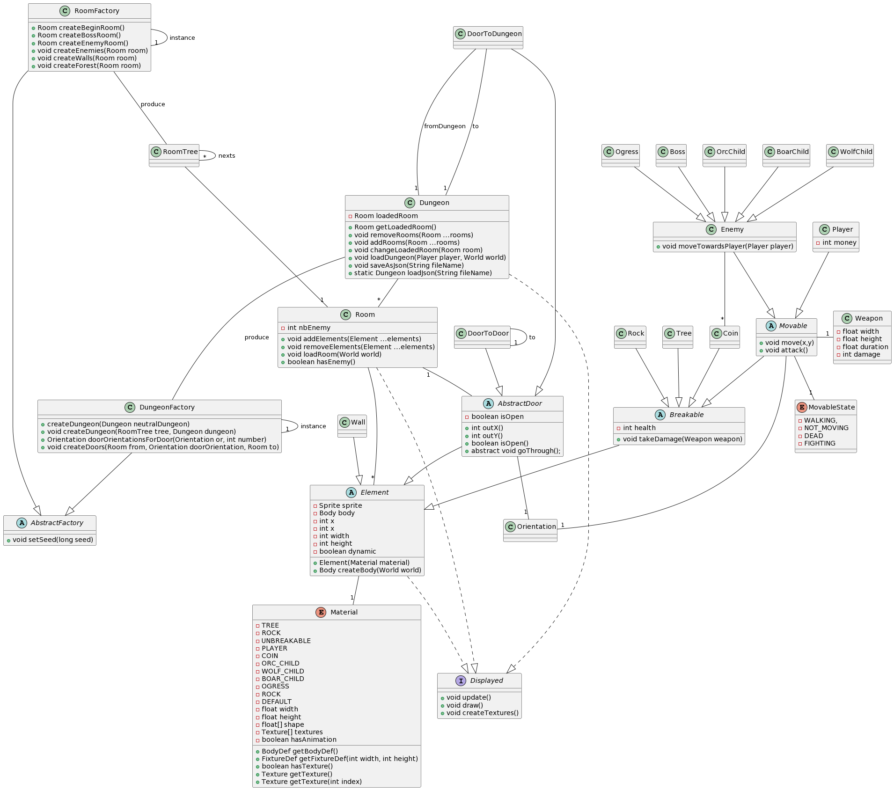

## Sprint2

Backlogs, diagramme sprint2 début, diagramme sprint2 fin, sprint rétrospective et sprint review

### Backlog

- [X] Création d'une factory pour un donjon (génération procédurale d'un donjon) - Matthieu
- [X] Refresh du donjon à chaque fin de celui-ci (passage par salle neutre : recréation d'un donjon) - Matthieu
- [X] Fond d'écran pour un donjon, Paul
- [X] Repositionnement des hitboxs en fonction des textures + changement des hitboxs, Paul
- [X] Autres armes, ennemis, Paul
- [X] Création d'un HUD pour la vie du joueur et la vie des ennemis, Arthur
- [X] Création d'un dash du joueur (boost de vitesse), Arthur
- [X] Les ennemis lâchent des pièces lors de leur mort qui sont récupérables par le joueur, Zinedine
- [X] Animations des textures (Portes, Pièces), Zinedine
- [X] Texte de mort et recommencement du jeu, Arthur

### Diagramme de classes Sprint2 début

### Diagramme de classes Sprint2 fin

### Rétrospective

Tout a bien été implémenté, la répartition des tâches s'est plus fait en fonction de nos compétences respectives (+ de front pour Paul que de backend).