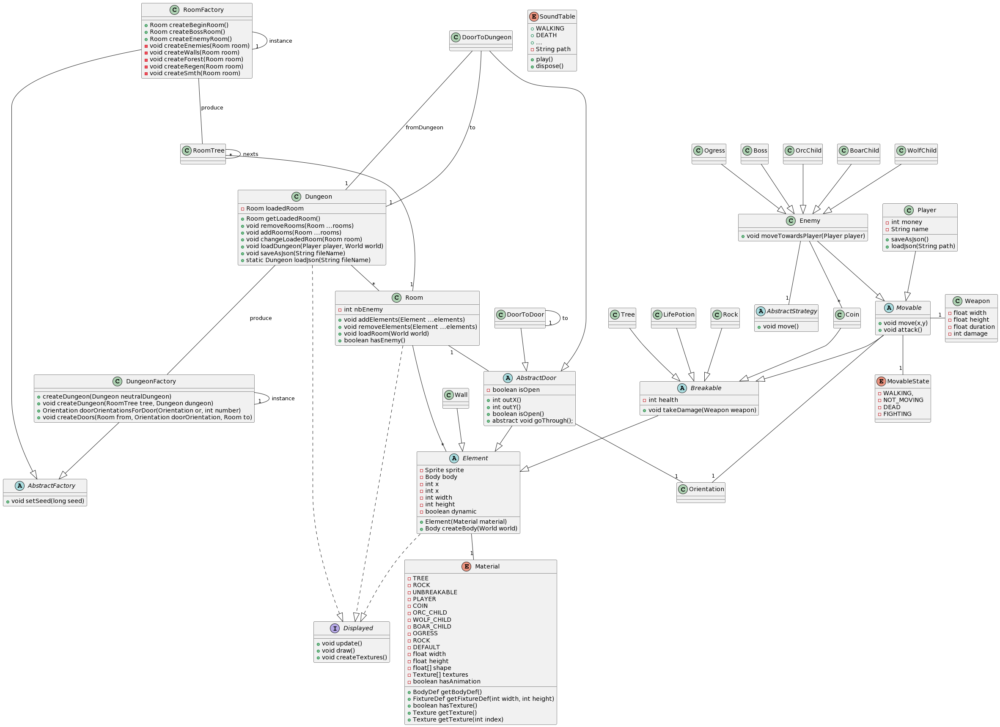
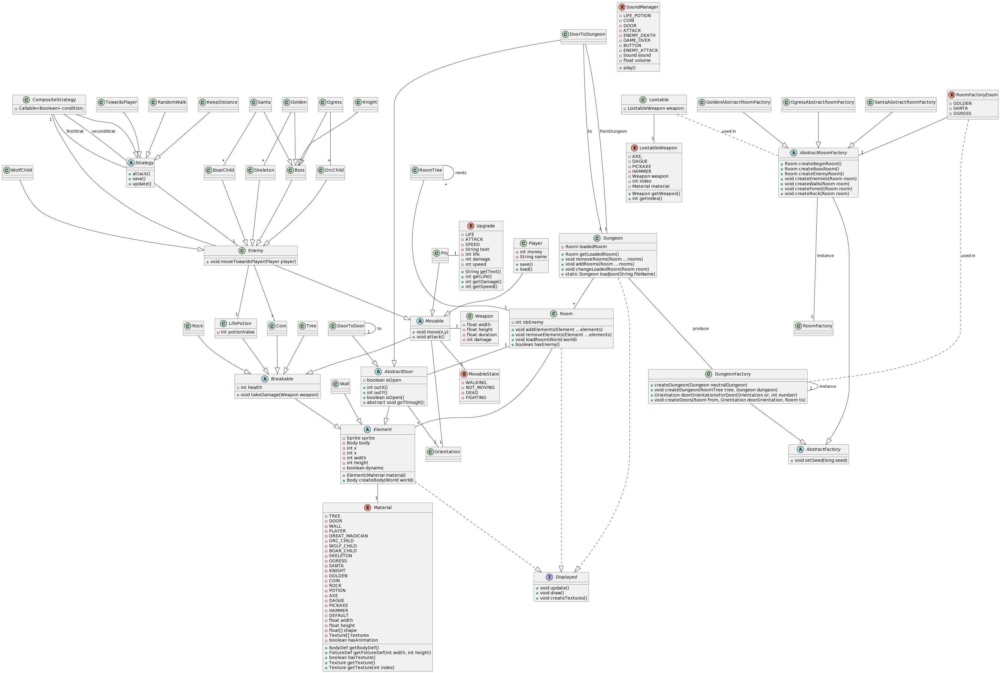
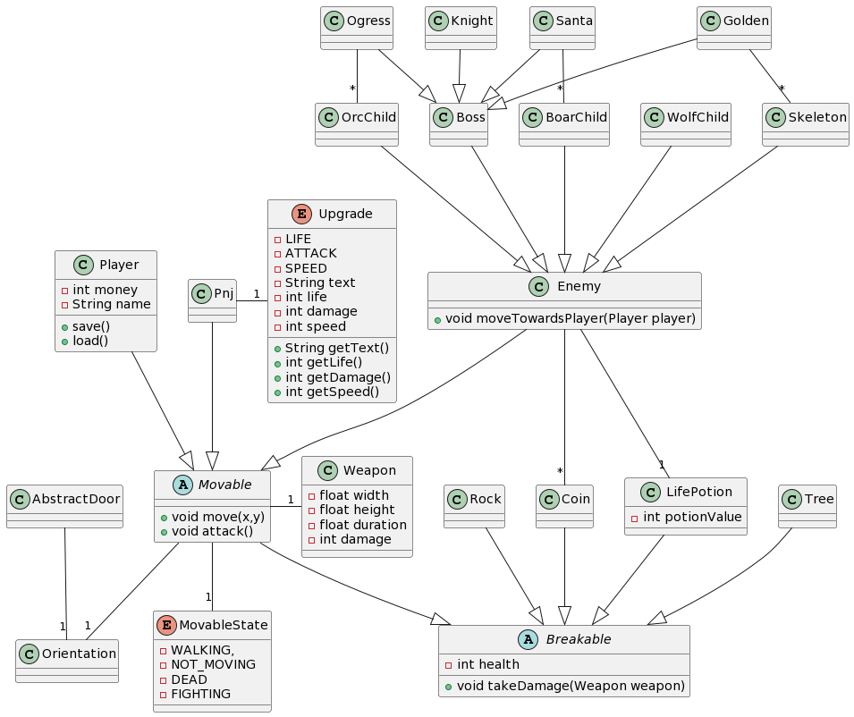
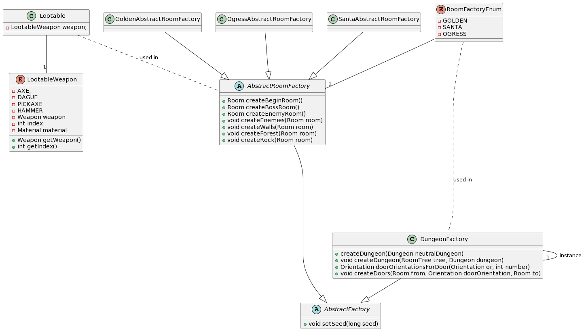
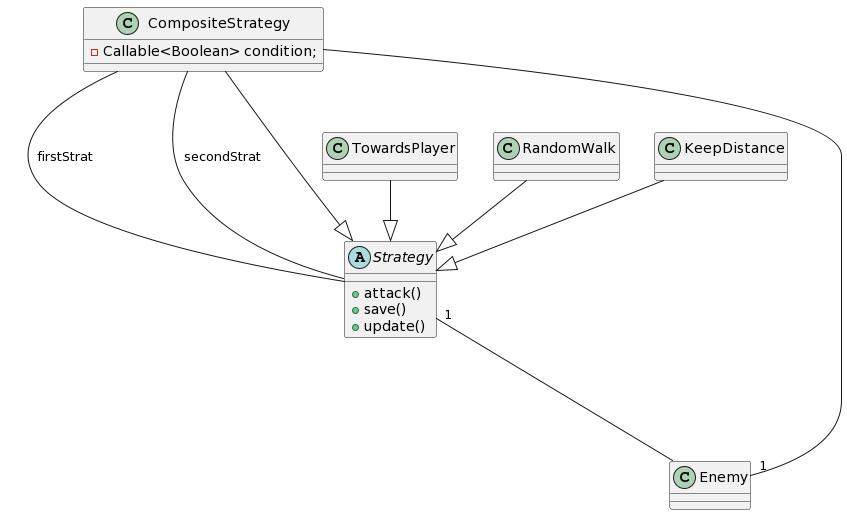

## Sprint3

Backlogs, diagramme sprint3 début, diagramme sprint3 fin, sprint rétrospective et sprint review

### Backlog

- [X] Ajout de sons, Zinedine
- [X] PNJ dans la salle neutre pour acheter des upgrades, Paul / Arthur
- [X] Mise en place des boss chaque fin de donjons, Paul
- [X] Sauvegarde du joueur
- [X] Recherche de bugs
- [X] Essayer d'ajouter les tests (faire marcher Junit avec Libgdx on sait jamais), Matthieu
- [X] Système pour regagner de la vie, Arthur
- [X] Salles spéciales (régénératives, de changement d'armes...), Matthieu
- [X] Nouvelles stratégies déplacement/attaque (pour les ennemis), Zinedine
- [X] HUD plus responsive (barre de vie max qui bouge = nombre de coins qui bougent), Arthur
- [X] Textures qui clignotent pour les objets breakable, Paul

### Diagramme de classes Sprint3 début

### Diagramme de classes Sprint3 fin

### Rétrospective

On a réussi à créer une interface de test pour libgdx avec une headless application et un mock, malgré tout,
tester chaque classe une par une requiert de moquer les parties des classes qui utilisent libgdx (et ces parties représentent 50 à 80% des classes).
Il reste donc compliqué de tester le projet en lui-même.
La plupart des choses à implémenter pour le reste réglait l'équilibrage du jeu en général ou corrigeait des bugs
donc code assez simple sur ce sprint.